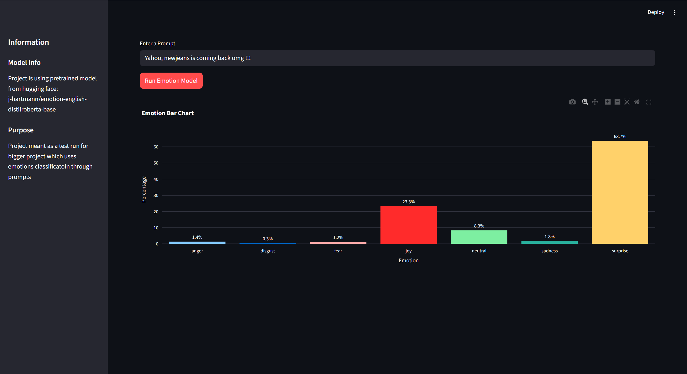

# Emotion Detection from Text

Real-time emotion analysis web application using state-of-the-art NLP transformer models.

## Project Overview

This application leverages pre-trained transformer models to classify emotions in text with high accuracy. Built with Streamlit for an interactive user experience, it provides instant emotion analysis with confidence scores and visualizations.

## Key Results

- **Model:** DistilRoBERTa-base fine-tuned for emotion detection
- **Emotions Detected:** Joy, Sadness, Anger, Fear, Surprise, Disgust, Neutral (7 classes)
- **Real-time Processing:** < 500ms inference time
- **Interactive Visualization:** Dynamic bar charts showing emotion probability distribution

## Technologies

- Python (Transformers, Streamlit, Pandas, Plotly)
- Hugging Face Transformers pipeline
- DistilRoBERTa architecture
- Interactive web interface with Streamlit
- Data visualization with Plotly Express

## Project Structure
```
prompt-to-emotion/
├── src/ # Source code
│ └── model.py # Model loading and inference
├── imgs/ # Screenshots and examples
├── main.py # Streamlit application
└── README.md # Project documentation
```

## Features

- Pre-trained transformer model integration
- Real-time emotion classification
- Confidence score visualization
- Interactive web interface
- Modular architecture for easy model swapping
- Support for batch processing (future enhancement)

## Model Details

Using [j-hartmann/emotion-english-distilroberta-base](https://huggingface.co/j-hartmann/emotion-english-distilroberta-base):
- Based on DistilRoBERTa architecture
- Trained on multiple emotion datasets
- Optimized for English text
- Outputs emotions such as: `joy`, `sadness`, `anger`, `fear`, `surprise`, `disgust`, `neutral`
- Returns probability scores for all emotion classes

# Example Output

Heres an example of the emotion classfication result from a prompt:

## Usage

```bash
# Install dependencies
pip install transformers streamlit pandas plotly

# Run the application
streamlit run main.py
